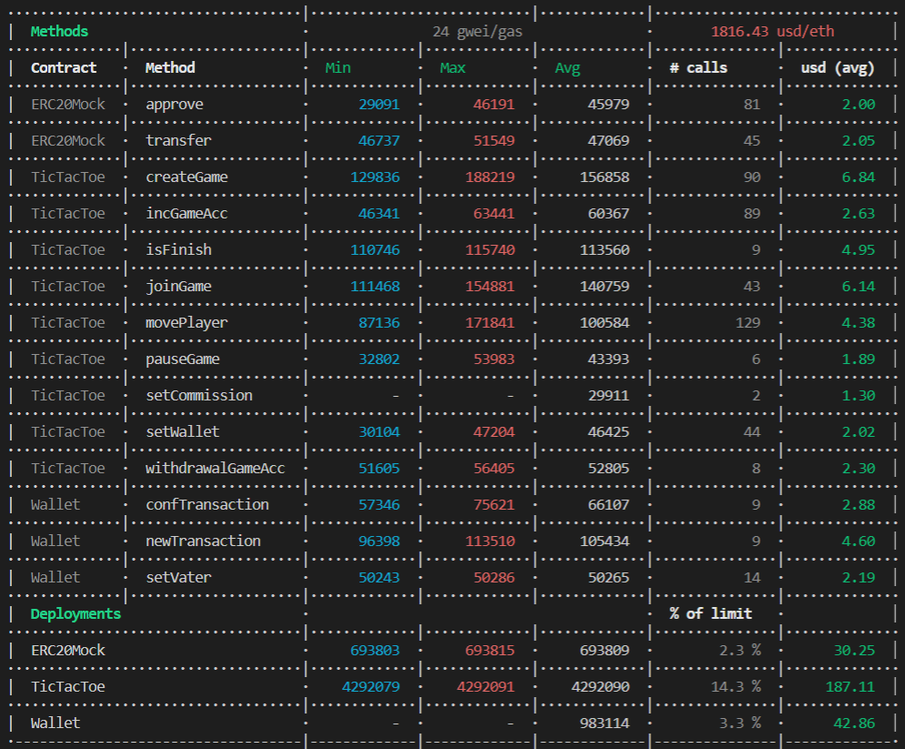

## ilink Academy. Домашняя работа #3. 

### Задача:  
Работа со смарт-контрактами ERC-20. Особенности проверки на сторонних контрактах. Мультиподпись.  
Новый функционал игры крестики-нолики.  
1. Добавить возможность делать ставки в нативном токене eth и ERC-20.  
При создании игры указываем размер ставки. Средства игрока должны холдировать. Второму игроку, который присоединяется к игре, также холдировать средства. 
2. После завершения игры, победитель получает все средства.  
3. Добавить комиссию платформы, процент или сумма. Задается настройками в смарт-контракте.  
4. Комиссия начисляется на смарт-контракт Wallet. С Wallet можно вывести с согласия двух адресов.  

### Реализация
Hardhat 2.9.1;  
Solidity 0.8.9;

### Решение  
Решение состоит из:  
- Смарт контракт "Крестики нолики"  
- Смарт контракт "Кошелек"  
- Смарт контракт "ERC20Mock"  
#### Контракт "Крестики нолики":  
Смарт контракт состоит из: 
1. Структура Game, которая описывает партию игры
- address player1 - Адрес первого игрока;  
- address player2 - Адрес второго игрока (Либо nulll address);  
- uint8[9] grid - Игровое поле 3*3. Счет идет с верхнего левого угла, по строкам;  
- uint256 timeStart - Момент времени, когда был совершен крайних ход (в секундах, начиная с 1 января 1970 года (эпоха unix));  
- uint32 timeWait - Время ожидания хода соперника, в секундах;  
- uint32 bet - Ставка игроков
- State state - Текущий статус игры.

2. Перечисление State, которая описает все стадии игры:  
- FindPlayers - Стадия поиска (ожидание присоединения) второго игрока;  
- EndFirst - Первый игрок сделал свой ход;  
- EndSecond - Второй игрок сделал свой ход;  
- Pause - Первый игрок не дождался подключения второго игрока и поставил поиск на паузу;  
- Draw - Игра завершилась ничьей;  
- WinFirst - Игра завершилась победой первого игрока;  
- WinSecond - Игра завершилась победой второго игрока.  

3. Массив Game[] games, который хранит все игры.  
4. Массив  uint8[3][8] winCombinations, который хранит все возможные победные комбинации.  
5. Соответствие mapping (address => uint256) public playerGamesCount; // соответствие (адрес игрока => количество игр) 
6. Переменные:
- address owner - Адрес владельца контракта
- address wallet - Адрес контракта "Кошелек"
- IERC20 token - Игровая валюта
- uint8 commission - Комиссия за участие в игре (по умолчанию равна 10%).
- uint256 ethPerErc - Стоимость одной игровой валюты (по умолчанию равно 1 finney)

Реализованные методы (Только новые или обновленные, описание остального функционала можно найти в предыдущем ДЗ):
1. Пополнить свой игровой счёт:  
`function incGameAcc() external payable`
Игрок отправляет эфир на эту функцию с помощью параметра msg.value. Эфир пересчитывается по курсу ethPerErc и токены начисляются на игровой счёт  

2. Снять средства со своего игрового счёта:  
`function withdrawalGameAcc(uint256 _amountERC) external nonReentrant`  
_amountERC - Количество монет, которые хочешь вывести.
Прежде пользователь должен подтвердить эту операцию с помощью метода approve.  

3. Создать игру и сделать ставку:  
`function createGame(uint32 _timeWait, uint32 _bet) external payable`  
_timeWait - время ожидания хода соперника, _bet - ставка в ERC.  
Игрок может сделать ставку в токенак ERC или в ETH.  
Чтобы сделать ставку в ERC, необходимо: подтвердить эту операцию с помощью метода approve; указать сумму ставки в параметре _bet. Чтобы cделать ставку в ETH, необходимо: передать ETH в функцию с помощью параметра msg.value.  

4. Присоединиться к игре и сделать ставку:  
`function joinGame(uint256 _idGame) external outOfRange(_idGame)`  
_idGame - Идентификатор игры (её порядковый номер в массиве games).  
Игрок может сделать ставку в токенак ERC или в ETH.  
Чтобы cделать ставку в ERC, необходимо: подтвердить эту операцию с помощью метода approve. Чтобы cделать ставку в ETH, необходимо: передать ETH в функцию с помощью параметра msg.value.  

5. Сделать ход:  
`function movePlayer(uint256 _idGame, uint256 _cell) external outOfRange(_idGame)`  
_idGame - Идентификатор игры (её порядковый номер в массиве games), _cell - клетка на игровом поле (0..8).   
В случае, если ход игрока оказался победным (или игра свелась в ничью), то производится расчет с игроками и перевод комиссии на кошелек. Расчет с игроками производится в том виде, как они делали ставку (В виде ETH или ERC) 

6. Завершить игру (Проверить на признаки завершения):  
`function isFinish(uint256 _idGame) external outOfRange(_idGame) returns (uint256)`  
_idGame - Идентификатор игры (её порядковый номер в массиве games).  

#### Контракт "Кошелек":   
Смарт контракт состоит из:  
1. Структура Transaction, которая описывает одну транзакцию;  
- address to - Адрес получателя средств;  
- uint256 amount - Сумма перевода;  
- bool[3] arr - Список голосов доверенных лиц;  
- bool isSend - Флаг, показывающий отправлена транзакция или нет;  
2. Массив Transaction[] _transactions, который хранит все транзакции.  
3. Переменные:
- address _owner - Адрес владельца контракта  
- address _voting1 - Адрес доверенного лица №1  
- address _voting2 - Адрес доверенного лица №2  
- 
Реализованные методы:
1. Создать новую транзакцию:  
`function newTransaction(address _to, uint256 _amount) external isVoter`
_to - Адрес получателя, _amount - Сумма средств.  
Транзакцию  может создать только владелец или доверенное лицо. Учитывается доступная сумма средств на контракте в момент создания транзакции.

2. Подтвердить транзакцию:  
`function confTransaction(uint256 _idTransaction) external isVoter`
_idTransaction - id транзакции.  
Подтвердить транзакцию может только владелец или доверенное лицо. Причем пользователь не может подтвердить транзакцию, если она предназначена ему. После подтверждения транзакции, если голосов становится 2 или больше, то транзакция совершается.  

#### Задачи для cli hardhat (TicTacToe)
Смарт контракт размещался в тестовой сети Rinkeby. Предоставлены только новые или обновленный задачи (Описание остального функционала можно найти в предыдущем ДЗ). 
1. Создать игру и сделать ставку в ERC:  
`npx hardhat create-game-erc --network rinkeby --address $address --player $player --time $time --bet $bet`  
$address - адрес контракта, $player - порядковый номер счета из mnemonic, $time - время ожидания хода соперника, $bet - ставка в erc. 

2. Создать игруи сделать ставку в ETH:  
`npx hardhat create-game-eth --network rinkeby --address $address --player $player --time $time --bet $bet`  
$address - адрес контракта, $player - порядковый номер счета из mnemonic, $time - время ожидания хода соперника, $bet - ставка в eth. 

3. Присоединиться к игре и сделать ставку в ERC:  
`npx hardhat join-game-erc --network rinkeby --address $address --player $player --id $id --bet $bet`  
$address - адрес контракта, $player - порядковый номер счета из mnemonic, $id - идентификатор игры (её порядковый номер в массиве games), $bet - ставка в erc.  

4. Присоединиться к игре и сделать ставку в ETH:  
`npx hardhat join-game-eth --network rinkeby --address $address --player $player --id $id --bet $bet`  
$address - адрес контракта, $player - порядковый номер счета из mnemonic, $id - идентификатор игры (её порядковый номер в массиве games), $bet - ставка в eth.  

5. Сделать ход:  
`npx hardhat move-game --network rinkeby --address $address --player $player --id $id --cell $cell`  
$address - адрес контракта, $player - порядковый номер счета из mnemonic, $id - идентификатор игры (её порядковый номер в массиве games), $cell - клетка на игровом поле (0..8).  

6. Завершить игру (Проверить на признаки завершения):  
`npx hardhat isFinish --network rinkeby --address $address --player $player --id $id`  
$address - адрес контракта, $player - порядковый номер счета из mnemonic, $id - идентификатор игры (её порядковый номер в массиве games).  

7. Пополнить свой игрвой счёт:  
`npx hardhat balance-erc --network rinkeby --address $address`
$address - адрес контракта.  

8. Снять средства со своего игрового счёта:  
`npx hardhat withdrawal-game-acc --network rinkeby --address $address --player $player --amount $amount`  
$address - адрес контракта, $player - порядковый номер счета из mnemonic, $amount - Количество монет, которые хочешь вывести.  

9. Установить адрес кошелька:  
`npx hardhat set-wallet --network rinkeby --address $address --player $player --wallet $wallet`  
$address - адрес контракта, $player - порядковый номер счета из mnemonic, $wallet - новый адрес кошелька.   

#### Задачи для cli hardhat (Wallet)
Смарт контракт размещался в тестовой сети Rinkeby.  
1. Новый адрес доверенного лица:  
`npx hardhat set-vater --network rinkeby --address $address --player $player --vater $vater --id $id`
$address - адрес контракта, $player - порядковый номер счета из mnemonic, $vater - адрес нового доверенного лица, $id - номер довереного лица (1 или 2). 

2. Создать транзакцию на вывод средств с кошелька:  
`npx hardhat new-transaction --network rinkeby --address $address --player $player --to $to --amount $amount`
$address - адрес контракта, $player - порядковый номер счета из mnemonic, $to - адрес получателя транзакции, $amount - сумма для вывода средств. 

3. Подтвердить транзакцию:  
`npx hardhat conf-transaction --network rinkeby --address $address --player $player --id $id`
$address - адрес контракта, $player - порядковый номер счета из mnemonic, $id - идентификатор транзакции. 

#### Тестирование
Автоматизированные тесты (Игровая логика) описаны в файле tests\TicTacToe.test.ts и запускаются командой:  
`npx hardhat test tests\TicTacToe.test.ts`

Автоматизированные тесты (Бизнес логика) описаны в файле tests\TicTacToe_pay.test.ts и запускаются командой:  
`npx hardhat test tests\TicTacToe_pay.test.ts`

Автоматизированные тесты (Контракт кошелька) описаны в файле tests\Wallet.test.ts и запускаются командой:  
`npx hardhat test tests\Wallet.test.ts`

Анализ расхода газа можно включить с помощью ключа GAS_REPORT:

#### Проверка и публикация исходного кода контракта
Команда для публикации контракта в тестовой сети ropsten:  
`npx hardhat deploy --network ropsten --tags TicTacToe`  
`npx hardhat deploy --network ropsten --tags Wallet`

Команда для верификации контракта в сети ropsten:  
`npx hardhat --network ropsten etherscan-verify --solc-input --contract-name TicTacToe`  
`npx hardhat --network ropsten etherscan-verify --solc-input --contract-name Wallet`

Адрес смарт контракта TicTacToe: `0x8D49D9C2fAd468d346c6EC00CE59Ccd3fEB7844A`
Адрес смарт контракта Wallet: `0xfC660D968e486f44A18CC828b58c7cB05081F5F6`

#### Ход игровых партий и распределение средств  

1.Исходное состояние  
2. Player1 пополняет свой игровой счёт на 10 монет ERC  
3. Player2 пополняет свой игровой счёт на 10 монет ERC  
4. Player0 устанавливает адрес кошелька  
5. Player1 создаёт игру и делает ставку 10 монет ERC  
6. Player2 присоединяется к игре и делает ставку 10 монет ERC  
7. Player1 делает ход   
8. Player2 делает ход  
9. Player1 делает ход   
10. Player2 делает ход  
11. Player1 делает ход (победный - расчет с игроком, вывод коммисиии)  
12. Player1 выводит монеты со своего игровго счета  
13.	Player1 создаёт игру и делает ставку 10 finney  
14.	Player2 присоединяется к игре и делает ставку 10 finney  
15. Player1 делает ход   
16. Player2 делает ход   
17. Player1 делает ход   
18. Player2 делает ход  
19. Player1 делает ход (победный - расчет с игроком, вывод коммисиии)  
20.	Player0 назначает доверенное лицо №1  
21.	Player0 назначает доверенное лицо №2  
22.	Player0 создает новую трназакцию для вывода средств с кошелька  
23.	Player0 подтверждает транзакцию  
24.	Player1 подтверждает трназакцию (Вывод средств с кошелька)  

| № | TicTacToe, ETH | TicTacToe, ERC | Player0, ETH | Player0, ERC | Player1, ETH | Player1, ERC | Player2, ETH | Player2, ERC | Wallet, ETH |
| - | - | - | - | - | - | - | - | - | - |
| 1 | 0 | 1000000 | 126863010369041836 | 0 | 50000000000000000 | 0 | 50000000000000000 | 0 | 0 |
| 2 | __10000000000000000__ | __999990__ | 126863010369041836 | 0 | __39748715496025789__ | __10__ | 50000000000000000 | 0 | 0 |
| 3 | __20000000000000000__ | __999980__ | 126863010369041836 | 0 | 39748715496025789 | 10 | __39757265496596758__ | __10__ | 0 |
| 4 | 20000000000000000 | 999980 | __126792204367625716__ | 0 | 39748715496025789 | 10 | 39757265496596758 | 10 | 0 |
| 5 | 20000000000000000 | __999990__ | 126792204367625716 | 0 | __39269626989881016__ | __0__ | 39757265496596758 | 10 | 0 |
| 6 | 20000000000000000 | __1000000__ | 126792204367625716 | 0 | 39269626989881016 | 0 | __39238808229207208__ | __0__ | 0 |
| 7 | 20000000000000000 | 1000000 | 126792204367625716 | 0 | __39001752934725016__ | 0 | 39238808229207208 | 0 | 0 |
| 8 | 20000000000000000 | 1000000 | 126792204367625716 | 0 | 39001752934725016 | 0 | __39019988226493840__ | 0 | 0 |
| 9 | 20000000000000000 | 1000000 | 126792204367625716 | 0 | __38870315432096266__ | 0 | 39019988226493840 | 0 | 0 |
| 10 | 20000000000000000 | 1000000 | 126792204367625716 | 0 | 38870315432096266 | 0 | __38882465223835062__ | 0 | 0 |
| 11 | __18000000000000000__ | __999982__ | 126792204367625716 | 0 | __38493392928327041__ | __18__ | 38882465223835062 | 0 | __2000000000000000__ |
| 12 | __0__ | __1000000__ | 126792204367625716 | 0 | __56255064426216860__ | __0__ | 38882465223835062 | 0 | 2000000000000000 |
| 13 | 10000000000000000 | 1000000 | 126792204367625716 | 0 | __46034642423718744__ | 0 | 38882465223835062 | 0 | 2000000000000000 |
| 14 | 20000000000000000 | 1000000 | 126792204367625716 | 0 | 46034642423718744 | 0 | __28715263221940106__ | 0 | 2000000000000000 |
| 15 | 20000000000000000 | 1000000 | 126792204367625716 | 0 | __45879888921861702__ | 0 | 28715263221940106 | 0 | 2000000000000000 |
| 16 | 20000000000000000 | 1000000 | 126792204367625716 | 0 | 45879888921861702 | 0 | __28583953220364386__ | 0 | 2000000000000000 |
| 17 | 20000000000000000 | 1000000 | 126792204367625716 | 0 | __45660796420196599__ | 0 | 28583953220364386 | 0 | 2000000000000000 |
| 18 | 20000000000000000 | 1000000 | 126792204367625716 | 0 | 45660796420196599 | 0 | __28446412218438812__ | 0 | 2000000000000000 |
| 19 | 0 | 1000000 | 126792204367625716 | 0 | __63359161417662865__ | 0 | 28446412218438812 | 0 | __4000000000000000__ |
| 20 | 0 | 1000000 | __126666596866821828__ | 0 | 63359161417662865 | 0 | 28446412218438812 | 0 | 4000000000000000 |
| 21 | 0 | 1000000 | __126591167865966966__ | 0 | 63359161417662865 | 0 | 28446412218438812 | 0 | 4000000000000000 |
| 22 | 0 | 1000000 | __126317942864109036__ | 0 | 63359161417662865 | 0 | 28446412218438812 | 0 | 4000000000000000 |
| 23 | 0 | 1000000 | __126180157863172098__ | 0 | 63359161417662865 | 0 | 28446412218438812 | 0 | 4000000000000000 |
| 24 | 0 | 1000000 | 126180157863172098 | 0 | __63242402916261763__ | 0 | __32446412218438812__ | 0 | __0__ |

